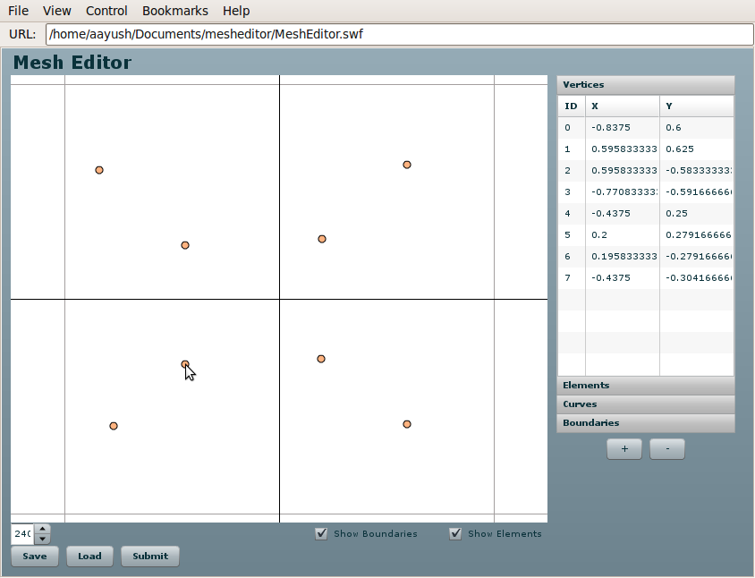
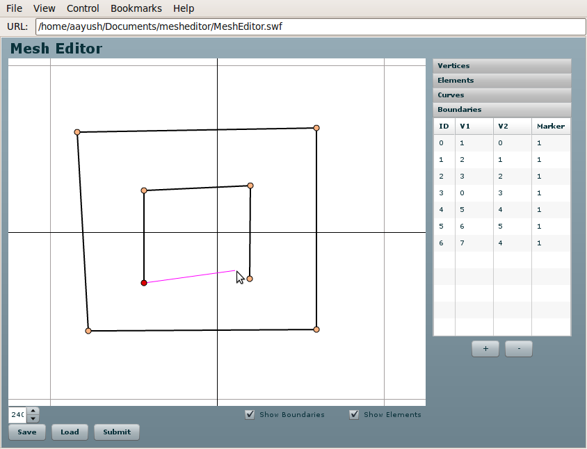
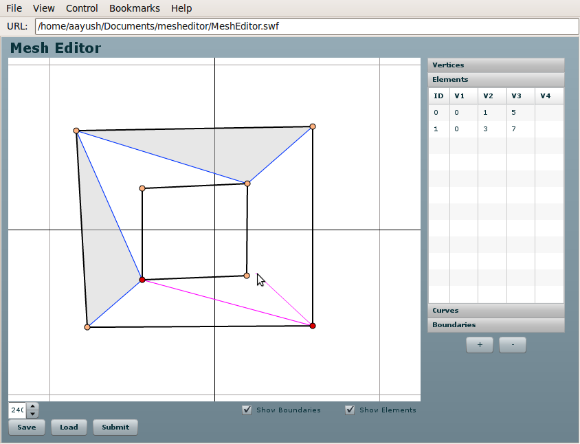
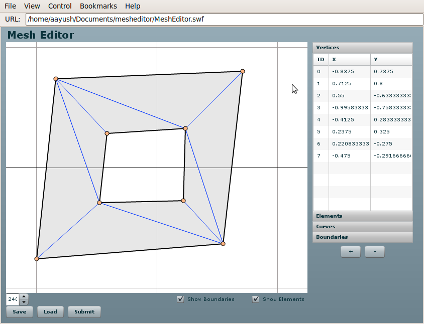

============
Introduction
============

This is a documentation for Finite Element MeshEditor for `FEMhub <http://femhub.org>`_.
It is being developed by hp-FEM group at University of Nevada, Reno.

MeshEditor is available under the GPL license (Version 2, 1991).

The source code can be viewed in the `git repository <http://github.com/aayush/mesheditor.git>`_.
The latest development is in branch zoom.

Build Instructions
------------------
Flex sdk can be downloaded from http://www.adobe.com/cfusion/entitlement/index.cfm?e=flex3sdk

To compile the MeshEditor place flex_sdk/bin to your system path and do
::
    \$ make

To test it open the MeshEditor.swf with your browser. You will need flash player 10 or above.
You can also use the MeshEditor on the FEMhub online lab.

Using MeshEditor on FEMhub Online Lab
-------------------------------------
First of all type the follwing in the input window box in FEMhub worksheet:
::
    from femhub import Mesh
    m = Mesh()
    m.edit()

Then the MeshEditor will appear on the browser. You can play with it creating new elements, vertices, and boundaries.

Creating New Vertices
~~~~~~~~~~~~~~~~~~~~~
Press Ctrl+click to create new vertices. You can edit the exact coordinates of the vertices on the X and Y column at the right. 
You can do doubleclick to remove the vertices.

Creating New Boundaries
~~~~~~~~~~~~~~~~~~~~~~~
Click the "Boundaries" tab on the right, and click on the vertices to draw boundaries as shown in the following image. 
You can edit the boundary Marker on the Marker column at right. You can also delete the boundaries by doubleclicking.

Creating New Elements
~~~~~~~~~~~~~~~~~~~~~
Click the "Elements" tab, and click on each vertices to create elements as shown in the following image.
You can delete the elements by double-clicking.

The final output can be something like this:

